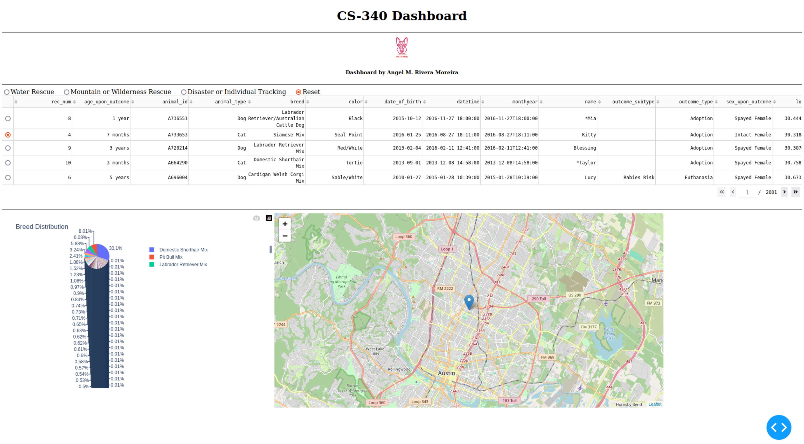
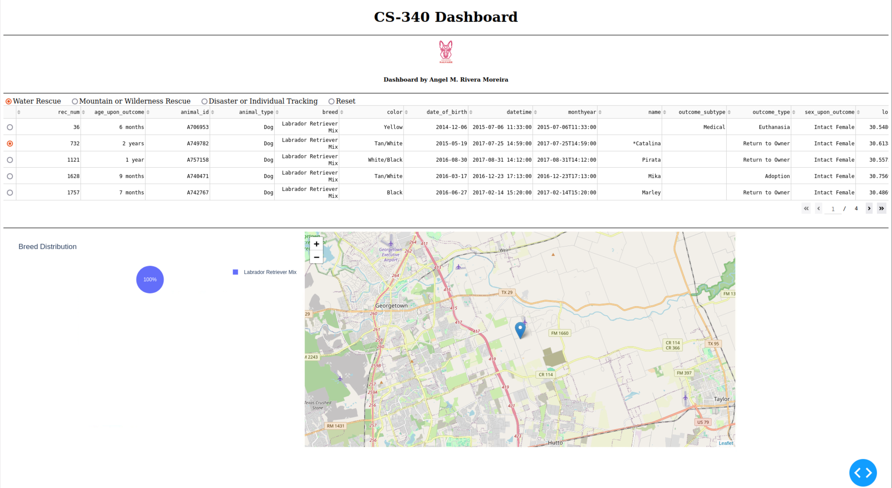
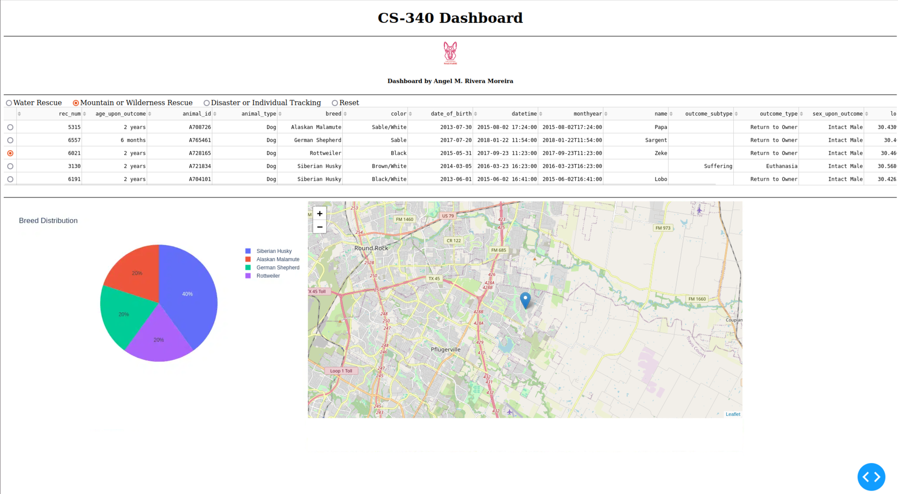
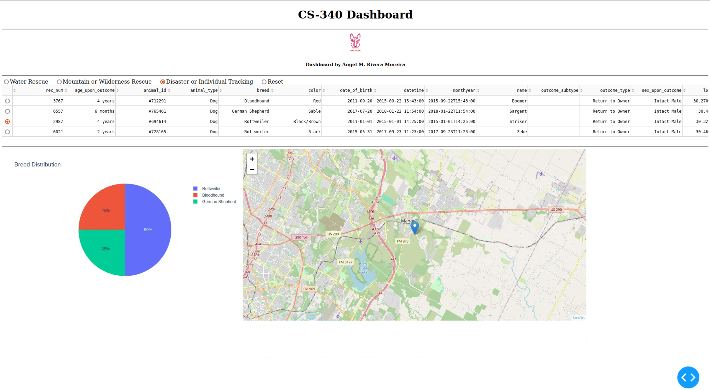
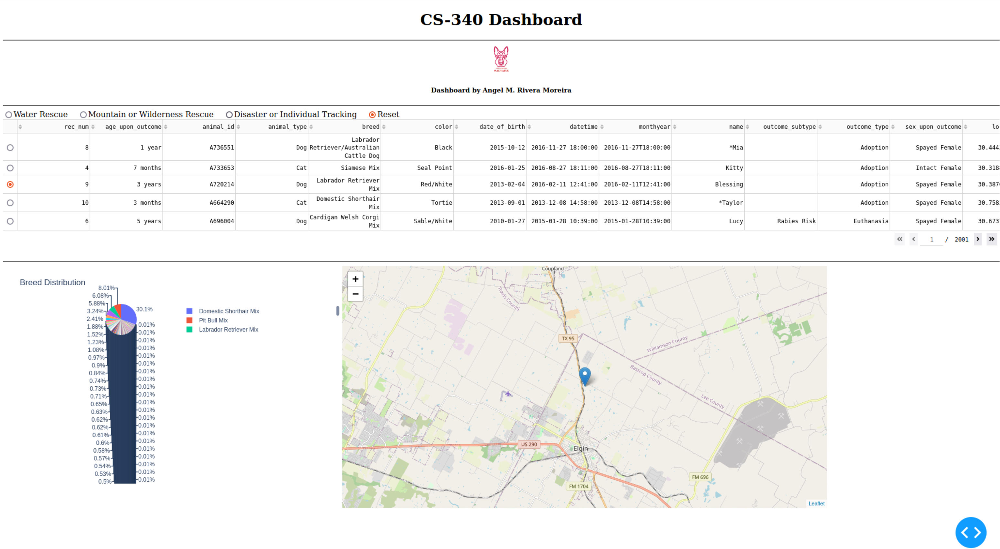

Angel M. Rivera Moreira  
SNHU CS-340  
7-1 Project Two Submission README  
April 2025  

---

## About the Project / Grazioso Salvare Dashboard

This project delivers an interactive web dashboard designed for Grazioso Salvare, a rescue-animal training organization. It connects to a MongoDB database containing data from the Austin Animal Center (AAC) and provides an interface for filtering, analyzing, and geolocating animals that may be suitable for search-and-rescue training. The dashboard is implemented using Python, Dash, Plotly, and Dash Leaflet, with MongoDB serving as the data source.

---

## Motivation

The purpose of this project is to demonstrate how full-stack technologies can work together in a real-world application. It builds on previous work implementing a CRUD Python module (animalShelter.py), extending functionality into a full user-facing dashboard. The dashboard helps Grazioso Salvare identify animals suitable for Water Rescue, Mountain/Wilderness Rescue, and Disaster or Individual Tracking based on preferred breed, sex, and age.

---

## Getting Started

To run the dashboard, make sure you either:

- Have a working MongoDB connection (via a local or remote instance), or
- Substitute in mock data for testing/demo purposes

This code was developed and tested using the SNHU Apporto environment. The default connection string assumes access to a MongoDB instance via credentials configured in the `animalShelter.py` module.

---

## Installation

The following tools and libraries were used to develop this dashboard:

- **Python 3.x**: Base programming language
- **Dash**: Web application framework for building dashboards
- **Dash Leaflet**: For displaying animal locations on an interactive map
- **Plotly Express**: For data visualization (pie chart)
- **Pandas**: For in-memory data management
- **MongoDB**: NoSQL database backend
- **PyMongo**: MongoDB driver for Python

Install dependencies with:

    pip install dash pandas plotly dash-leaflet pymongo jupyter-dash

---

## Usage

Once the dependencies are installed, launch the dashboard via:

    jupyter notebook ProjectTwoDashboard.ipynb

### Example: Reusing `animalShelter.py`

You can reuse the `animalShelter.py` module in other Python scripts or applications to interact with the AAC MongoDB database.

    from animalShelter import AnimalShelter

    # Connect to MongoDB using provided credentials
    username = "your_username_here"
    password = "your_password_here"
    shelter = AnimalShelter(username, password)

    # Example: Read Labrador Retrievers under 3 years old
    query = {
        "breed": "Labrador Retriever Mix",
        "age_upon_outcome_in_weeks": {"$lt": 156}
    }

    results = shelter.read(query)

    for dog in results:
        print(dog["name"], "-", dog["breed"])

> Replace `your_username_here` and `your_password_here` with the credentials provided to you by your instructor or course platform.

---

## Screenshots

Screenshots demonstrating dashboard functionality:

| State | Screenshot |
|-------|------------|
| Initial Dashboard |  |
| Water Rescue Filter |  |
| Mountain Rescue Filter |  |
| Disaster Tracking Filter |  |
| Reset View |  |

Replace the placeholder image paths with your actual screenshots.

---

## Tests

The dashboard was tested within a Jupyter environment. Each filter was applied and confirmed to dynamically update the table, chart, and map. Manual testing confirmed the interactive callbacks behaved as expected for each rescue type. Chart and map errors were handled gracefully if the dataset became empty.

---

## Roadmap

Planned future enhancements include:

- Dynamic filtering using dropdown menus
- Error logging when MongoDB becomes unreachable
- Improved map zoom logic based on filtered data
- Support for environment variables in the CRUD module

---

## Questions 

### How do you write programs that are maintainable, readable, and adaptable? Especially consider your work on the CRUD Python module from Project One, which you used to connect the dashboard widgets to the database in Project Two. What were the advantages of working in this way? How else could you use this CRUD Python module in the future?

Throughout Project One and Project Two, I focused on writing modular code that separates concerns, which improves maintainability and readability. For example, the `animalShelter.py` CRUD module provided a reusable interface for interacting with the MongoDB database, keeping database operations isolated from the dashboard logic. This made it easier to connect the dashboard widgets without duplicating code. Working in this way allowed for faster development and easier debugging. In the future, this CRUD module could be reused in other applications that require access to the same database, or adapted for other MongoDB collections with minimal changes.

### How do you approach a problem as a computer scientist? Consider how you approached the database or dashboard requirements that Grazioso Salvare requested. How did your approach to this project differ from previous assignments in other courses? What techniques or strategies would you use in the future to create databases to meet other client requests?

I approach problems by breaking them down into smaller, manageable components and planning solutions before coding. For this project, I first understood Grazioso Salvare’s database and dashboard requirements, then mapped out how each dashboard component would interact with the data through the CRUD module. Compared to earlier assignments, this project required more upfront design thinking and a stronger focus on user interaction. In future projects, I will continue to apply this modular and iterative approach, ensuring that databases are structured to support both current and future client needs, and prioritizing scalability and flexibility.

### What do computer scientists do, and why does it matter? How would your work on this type of project help a company, like Grazioso Salvare, to do their work better?

Computer scientists solve real-world problems through technology by designing systems that manage, analyze, and present information effectively. In this project, the dashboard allows Grazioso Salvare to quickly filter and visualize data, helping them make faster, better-informed decisions about animal training candidates. Work like this matters because it enables organizations to operate more efficiently, reduces manual work, and provides actionable insights that can drive their missions forward.

---

## Contact

Angel M. Rivera Moreira  
📧 angel.riveramoreira@snhu.edu

